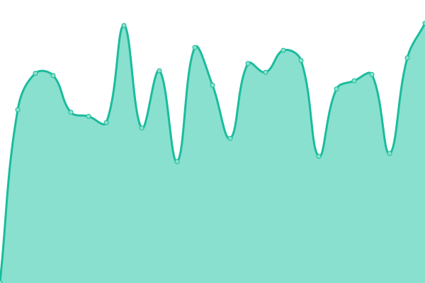

# [📈 Live Status](https://mcdave029.github.io/uptime-monitoring): <!--live status--> **🟩 All systems operational**

This repository contains the open-source uptime monitor and status page for [Mc Dave Valdecantos](https://www.linkedin.com/in/mc-dave-valdecantos-10325596), powered by [Upptime](https://github.com/upptime/upptime).

With [Upptime](https://upptime.js.org), you can get your own unlimited and free uptime monitor and status page, powered entirely by a GitHub repository. We use [Issues](https://github.com/mcdave029/uptime-monitoring/issues) as incident reports, [Actions](https://github.com/mcdave029/uptime-monitoring/actions) as uptime monitors, and [Pages](https://mcdave029.github.io/uptime-monitoring) for the status page.

<!--start: status pages-->
<!-- This summary is generated by Upptime (https://github.com/upptime/upptime) -->
<!-- Do not edit this manually, your changes will be overwritten -->
<!-- prettier-ignore -->
| URL | Status | History | Response Time | Uptime |
| --- | ------ | ------- | ------------- | ------ |
|  CG-B-Proxy | 🟩 Up | [cg-b-proxy.yml](https://github.com/mcdave029/uptime-monitoring/commits/HEAD/history/cg-b-proxy.yml) | 

 661ms
     
 | 

<a href="https://mcdave029.github.io/uptime-monitoring/history/cg-b-proxy">99.46%</a>
    

|  CG-C-Proxy | 🟩 Up | [cg-c-proxy.yml](https://github.com/mcdave029/uptime-monitoring/commits/HEAD/history/cg-c-proxy.yml) | 

 657ms
     
 | 

<a href="https://mcdave029.github.io/uptime-monitoring/history/cg-c-proxy">99.47%</a>
    

|  CG_C_S_STAT | 🟩 Up | [cg-c-s-stat.yml](https://github.com/mcdave029/uptime-monitoring/commits/HEAD/history/cg-c-s-stat.yml) | 

 695ms
     
 | 

<a href="https://mcdave029.github.io/uptime-monitoring/history/cg-c-s-stat">100.00%</a>
    

<!--end: status pages-->

[**Visit our status website →**](https://mcdave029.github.io/uptime-monitoring)

## 📄 License

- Powered by: [Upptime](https://github.com/upptime/upptime)
- Code: [MIT](./LICENSE) © [Mc Dave Valdecantos](https://www.linkedin.com/in/mc-dave-valdecantos-10325596)
- Data in the `./history` directory: [Open Database License](https://opendatacommons.org/licenses/odbl/1-0/)
